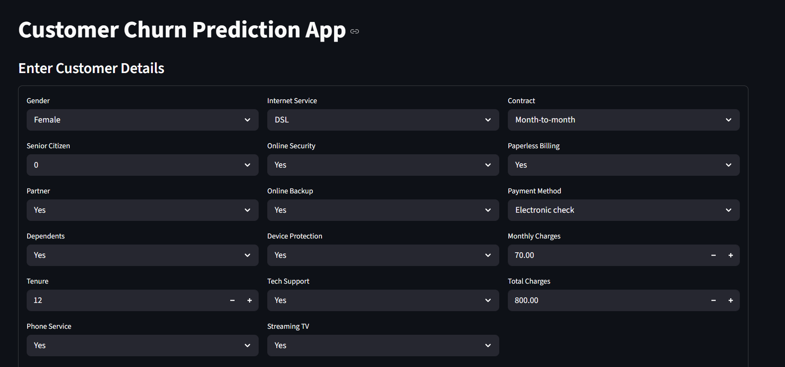
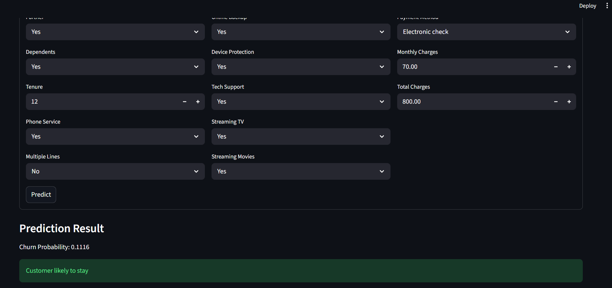

# 🚀 Customer Churn Prediction using Machine Learning

An end-to-end **Machine Learning project** that predicts whether a telecom customer is likely to churn based on their demographics, account details, and service usage.

This project demonstrates a **production-style ML pipeline**, model training, and deployment using an interactive **Streamlit web application**.

---

## 📌 Problem Statement

Customer churn is a critical business problem in the telecom industry. Retaining existing customers is significantly more cost-effective than acquiring new ones.

👉 The goal of this project is to:
- Predict whether a customer will churn
- Help businesses take proactive retention actions

---

## 🧠 Project Highlights

- ✅ End-to-end ML pipeline (Preprocessing → Feature Selection → Model)
- ✅ Handling missing values and categorical data
- ✅ Feature scaling and encoding using `ColumnTransformer`
- ✅ Feature selection using `RandomForest`
- ✅ Model training using **Gradient Boosting**
- ✅ Evaluation using **Accuracy & ROC-AUC**
- ✅ Modular and production-ready code structure
- ✅ Interactive UI using **Streamlit**
- ✅ Session-based sign-in and sign-up flow
- ✅ Accessible, age-friendly controls with clear risk summaries
- ✅ Assessment history with summary metrics and CSV export

---

## 🏗️ Project Structure
```
customer-churn-prediction/
│
├── api/
│ ├── main.py # FastAPI application
│ ├── schema.py # Request schema
│ └── utils.py # Prediction and recommendations
│
├── app/
│ └── app.py # Streamlit UI
│
├── src/
│ ├── pipeline.py # ML pipeline creation
│ ├── train.py # Model training script
│ └── predict.py # Prediction helper
│
├── models/
│ └── churn_model.pkl # Trained model (generated)
│
├── data/
│ └── raw/
│ └── Customer-Churn.csv
│
├── requirements.txt
├── render.yaml # Render deployment configuration
├── setup.py
└── README.md
```

---

## ⚙️ Tech Stack

- **Programming Language:** Python  
- **Libraries:**  
  - FastAPI and Uvicorn
  - Pandas, NumPy  
  - Scikit-learn  
  - Joblib  
  - Streamlit  
  - Requests

---

## 📊 Model Details

- **Feature Engineering:**
  - One-hot encoding for categorical variables
  - Standard scaling for numerical features

- **Model Used:**
  - Gradient Boosting Classifier

The trained pipeline is saved as `models/churn_model.pkl`. If scikit-learn is
upgraded, retrain the model before starting the API:
```bash
python -m src.train
```

---

## 🚀 Getting Started

### 1️⃣ Clone the repository
```bash
git clone https://github.com/your-username/customer-churn-prediction.git
cd customer-churn-prediction
```

### 2️⃣ Run locally
```bash
pip install -r requirements.txt
python -m uvicorn api.main:app --reload
```

The API will be available at `http://127.0.0.1:8000`. In a second terminal,
point the Streamlit app to the local API and start it:
```bash
$env:CHURN_API_URL = "http://127.0.0.1:8000/predict"
python -m streamlit run app/app.py
```

Open the Streamlit interface at `http://127.0.0.1:8501`.

To test the API directly, open `http://127.0.0.1:8000/docs` or send a request
to `http://127.0.0.1:8000/predict` with these fields:
```json
{
  "gender": "Female",
  "SeniorCitizen": 0,
  "Partner": "Yes",
  "Dependents": "No",
  "tenure": 12,
  "PhoneService": "Yes",
  "OnlineSecurity": "No",
  "OnlineBackup": "Yes",
  "DeviceProtection": "No",
  "TechSupport": "No",
  "StreamingTV": "No",
  "MonthlyCharges": 70,
  "TotalCharges": 800,
  "Contract": "Month-to-month",
  "PaperlessBilling": "Yes",
  "PaymentMethod": "Electronic check",
  "InternetService": "Fiber optic"
}
```

## ☁️ Deploy the API and Streamlit app

The project uses Render for the FastAPI backend and Streamlit Community Cloud
for the user interface. The included `render.yaml` creates the API service.

### 1️⃣ Deploy the FastAPI backend on Render

1. Push the repository to GitHub.
2. In Render, choose **New → Blueprint** and select the repository.
3. Wait for `customer-churn-api` to finish deploying.
4. Check `https://YOUR-API-NAME.onrender.com/health` and copy the API URL.

The prediction endpoint will be:
`https://YOUR-API-NAME.onrender.com/predict`.

### 2️⃣ Deploy the interface on Streamlit Community Cloud

1. Open [share.streamlit.io](https://share.streamlit.io) and choose **New app**.
2. Select the GitHub repository and its branch.
3. Set **Main file path** to `app/app.py`.
4. Open **Advanced settings → Secrets** and add:
  ```toml
  CHURN_API_URL = "https://YOUR-API-NAME.onrender.com/predict"
  ```
5. Select **Deploy**.

The same value is shown in `.streamlit/secrets.toml.example`. Never commit real
secrets to the repository.

The Streamlit sign-in and assessment history are session-based. For permanent
accounts and multi-user production authentication, connect the app to a real
database and authentication provider.

The API health endpoint is available at `/health`, and the interactive API documentation is available at `/docs`.

## 🖥️ Application Preview

### 📌 User Interface


### 📊 Prediction Result


